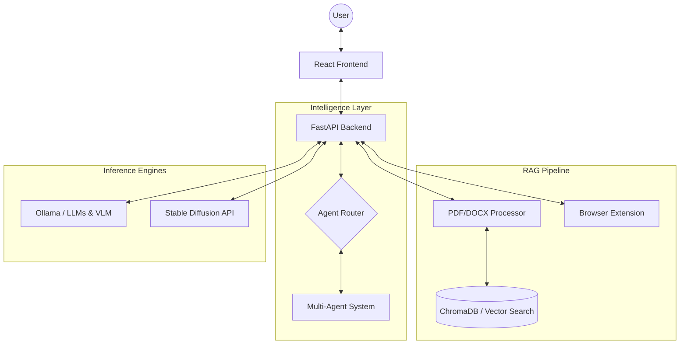

# 🧠 Offline AI Digital Brain

> A **privacy-first**, **fully local** AI ecosystem. Organize knowledge, collaborate with specialized agents, and process visual data—100% offline.

<div align="center">


</div>

---

## ✨ Overview

The **Offline AI Digital Brain** is a locally-hosted AI workstation that combines multi-agent intelligence, document RAG (Retrieval-Augmented Generation), and multimodal processing. 

### 🛡️ Why Local?
- **Zero External Dependencies** — No API keys or internet required.
- **Low Latency Inference** — Fast, local feedback for critical tasks.
- **Absolute Privacy** — Your data never leaves your disk.
- **Full Ownership** — No vendor lock-in or subscription fees.

---

## 📐 Architecture & Flow



---

## 🚀 Key Features

### 📚 Semantic Knowledge Base
- **Private RAG**: Semantic search across PDF, DOCX, and TXT using ChromaDB.
- **VLM OCR**: Advanced OCR for handwritten/scanned docs using LLava 7B.
- **Browser Capture**: Index web pages directly via the Chrome extension.

### 🤖 Autonomous Intelligence
- ** especializados Suite**: Agents for Research, Analysis, Synthesis, and Coding.
- **Writing Assistant**: Local drafting, summarization, and tone shifting.
- **AI Simulations**: Generate interactive quizzes from your documents.

### 🎨 Creative & Utilities
- **Image Suite**: Text-to-image (Stable Diffusion) and background removal.
- **Web Creator**: Instant website generation from natural language.
- **Local Translation**: Professional-grade offline translation service.

---

## 🛠️ Setup & Requirements

### 💻 System Requirements
| Component | Minimum | Recommended |
|---|---|---|
| **GPU** | 8GB VRAM (NVIDIA) | 12GB+ VRAM (NVIDIA RTX 3060+) |
| **RAM** | 16 GB | 32 GB |
| **Storage** | 50GB Free (SSD) | 100GB+ Free (NVMe SSD) |

### ⚡ Quick Start
1. **Pull Models**:
   `ollama pull tinyllama mistral llava nomic-embed-text`
2. **Backend**:
   ```bash
   cd backend
   python -m venv venv
   .venv\Scripts\activate  # Windows
   source venv/bin/activate  # Mac/Linux
   pip install -r requirements.txt
   python run.py
   ```
3. **Frontend**:
   `npm install && npm run dev`

---

## 📄 Documentation & Support

### 📁 Project Structure
- `src/`: React frontend (TypeScript)
- `backend/`: FastAPI orchestration & `backend/tests/`
- `archived_docs/`: [Research Papers & Design Guides](file:///c:/Users/Amrutha/Desktop/ai_brain-main/archived_docs/)
- `tests/`: Root-level integration utilities

### ⚠️ Troubleshooting FAQ
- **Connection Error?** Ensure `ollama serve` is running.
- **Slow Performance?** Check if models are running on GPU or CPU.
- **Memory Issues?** Close other VRAM-heavy apps or use smaller models (e.g., TinyLlama).

---

## 🛡️ Privacy & Contributing

### Privacy Commitments
- **100% Local Inference**: No data is sent to external AI providers.
- **Zero Telemetry**: We do not track usage or collect analytics.
- **Local Encryption**: All session data stays in your local `data/` folder.

### Contributing
We welcome local AI enthusiasts! Fork the repo, create a feature branch, and submit a PR. Please ensure all code passes the tests in the `tests/` folder.

---

<div align="center">
  <strong>Built for Privacy. Designed for Power. 🧠</strong><br/>
  MIT Licensed | © 2026 Offline AI Digital Brain Project
</div>
