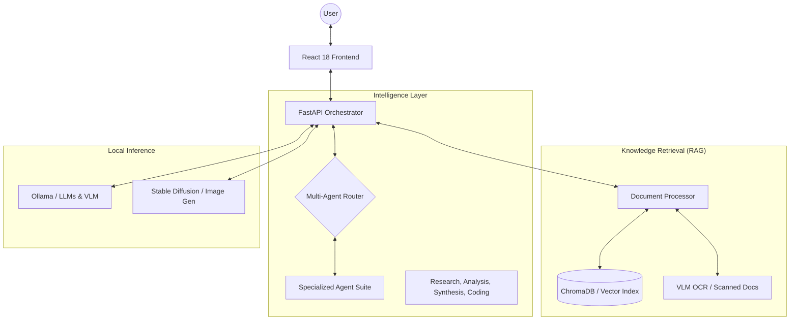

# 🧠 Offline AI Digital Brain

> A **privacy-first**, **state-of-the-art** local AI ecosystem. Organize knowledge, collaborate with specialized agents, and process visual data—100% offline.

<div align="center">


</div>

---

## ✨ Overview

The **Offline AI Digital Brain** is a locally-hosted AI workstation that combines multi-agent intelligence, document RAG (Retrieval-Augmented Generation), and multimodal processing. 

### 🛡️ Why Local?
- **Zero External Dependencies** — No API keys or internet required.
- **Low Latency Local Inference** — Fast, local feedback for critical tasks.
- **Absolute Privacy** — Your data never leaves your disk.
- **Full Ownership** — No vendor lock-in or subscription fees.

---

## 📐 System Architecture & Workflow



---

## 🚀 Key Features

### 📚 Semantic Knowledge Base
- **Private RAG**: Semantic search across PDF, DOCX, and TXT using ChromaDB.
- **VLM-powered OCR**: Advanced OCR for handwritten/scanned docs using LLava 7B.
- **Web Capture**: Index web pages directly via the Chrome extension.

### 🤖 Autonomous Intelligence
- **Specialized Agent Suite**: specialized agents for Research, Analysis, Synthesis, and Coding.
- **Writing Assistant**: Local drafting, summarization, and tone shifting.
- **Gamified Learning**: Generate interactive quizzes and simulations from your own knowledge.

### 🎨 Creative & Multimodal
- **Image Suite**: Text-to-image (Stable Diffusion) and background removal.
- **Web Creator**: Instant website generation from natural language description.
- **Offline Translation**: Professional-grade translation across multiple languages.

---

## 🖼️ Visual Demo

*(Add your screenshots and demo GIFs here to show off the UI!)*

| [SCREENSHOT: Chat Interface] | [SCREENSHOT: Document Viewer] |
|:---:|:---:|
| ✨ AI Agent Interaction | 📚 Semantic Knowledge Base |

---

## 🛠️ Setup & Requirements

### 💻 System Requirements
- **GPU**: 8GB VRAM Minimal (NVIDIA) | **12GB+ Recommended (RTX 3060+)**
- **RAM**: 16 GB Minimal | **32 GB Recommended**
- **Storage**: 50 GB+ High-speed SSD (NVMe preferred)

### ⚡ Quick Start
1. **Model Preparation**:
   `ollama pull tinyllama mistral llava nomic-embed-text`
2. **Environment Setup**:
   ```bash
   cd backend
   python -m venv venv
   # Terminal A: Start Backend
   .venv\Scripts\activate  # Windows
   source venv/bin/activate  # Mac/Linux
   pip install -r requirements.txt
   python run.py
   ```
3. **Interface Startup**:
   ```bash
   # Terminal B: Start Frontend
   npm install && npm run dev
   ```

---

## 📄 Documentation & Support

### 📁 Project Structure
- `src/`: Modern React frontend.
- `backend/`: FastAPI orchestration & test suites.
- `archived_docs/`: [Design Guides & Research Papers](https://github.com/AR118luv/ai_brain-main/tree/main/archived_docs)
- `tests/`: Root-level integration utilities.

### ⚠️ Troubleshooting
- **Connection Error**: Verify `ollama serve` is active.
- **GPU Utilization**: Ensure NVIDIA drivers and CUDA are configured correctly.
- **Port Conflict**: Check for existing processes on `8000` (Backend) or `5173` (Frontend).

---

## 🛡️ Privacy & Licensing

**100% Local Inference**: No data is ever sent to external cloud providers. We believe AI should be personal, private, and secure.

### Contributing
We welcome contributions! Fork the repository and read our guidelines at:
[https://github.com/AR118luv/ai_brain-main](https://github.com/AR118luv/ai_brain-main)

---

<div align="center">
  <strong>Privacy-first AI for everyone. 🧠</strong><br/>
  MIT Licensed | © 2026 Offline AI Digital Brain Project
</div>
