# 📊 AI Digital Brain - Interactive Flowcharts & Diagrams

This guide contains interactive flowchart visualizations of the system architecture and data flows.

---

## System Architecture Diagram

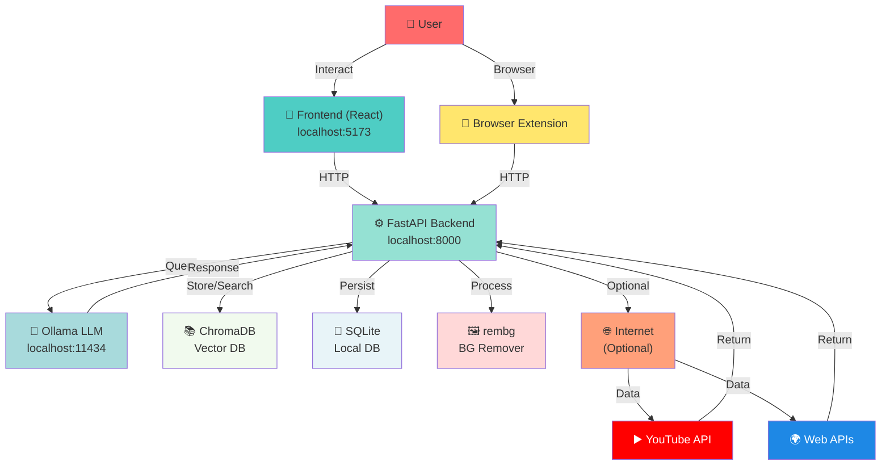

---

## Feature Categories Flow

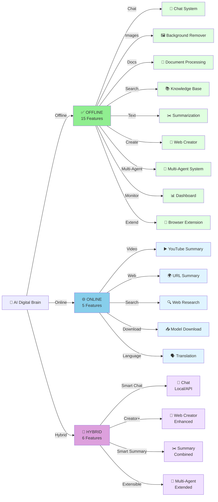

---

## User Request Decision Tree

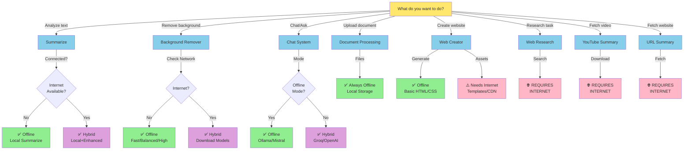

---

## Chat System - Offline vs Online

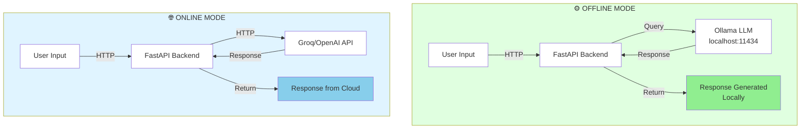

---

## Background Remover Pipeline

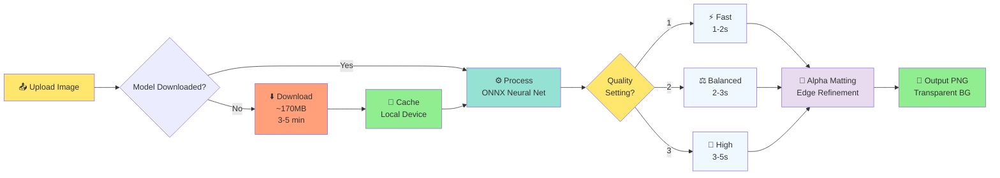

---

## Document Processing Pipeline

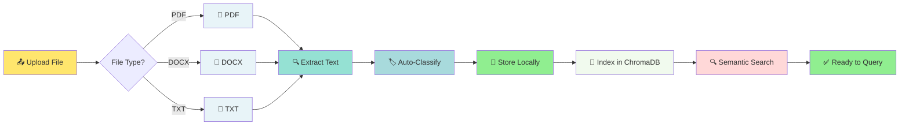

---

## Knowledge Base - Search Flow

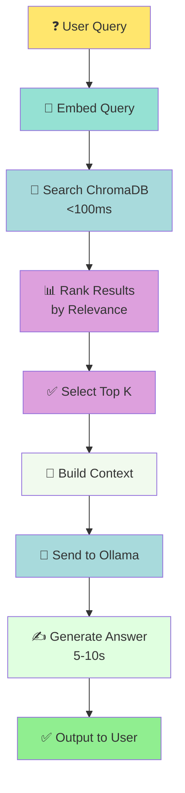

---

## Privacy Levels - Comparison

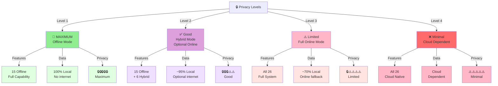

---

## Setup & Installation Flow

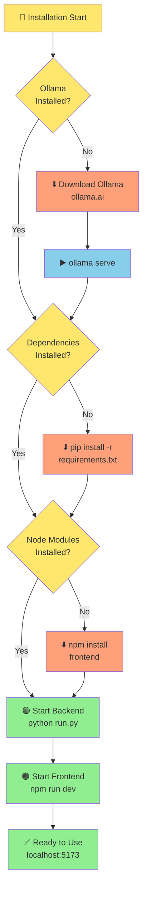

---

## Multi-Agent System - Logic Flow

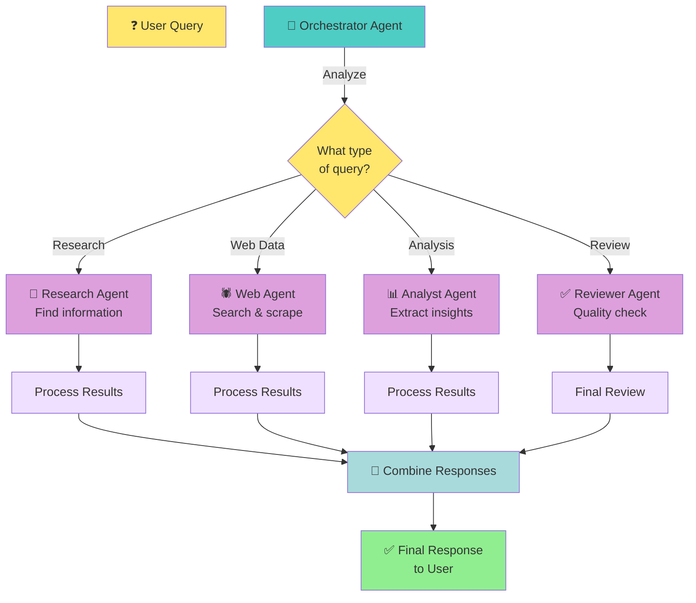

---

## YouTube Summary - Data Flow

```mermaid
graph LR
    Start["🎬 YouTube URL"]
    Fetch["⬇️ Download<br/>Captions/Metadata"]
    Extract["🔍 Extract Text"]
    Local["📝 Prepare<br/>for LLM"]
    Ollama["🤖 Ollama<br/>Summarize"]
    Summary["✅ Summary<br/>Generated"]
    
    Start -->|Via yt-dlp<br/>Requires Internet| Fetch
    Fetch -->|Local Process| Extract
    Extract -->|Local Process| Local
    Local -->|100% Offline| Ollama
    Ollama -->|Return| Summary
    
    style Start fill:#FFE66D
    style Fetch fill:#FFA07A
    style Extract fill:#95E1D3
    style Local fill:#F1FAEE
    style Ollama fill:#A8DADC
    style Summary fill:#90EE90
```

---

## URL Summary - Data Flow

```mermaid
graph LR
    Start["🌍 Website URL"]
    Fetch["⬇️ Download<br/>HTML/Content"]
    Clean["🧹 Extract Text<br/>Remove Boilerplate"]
    Process["📝 Prepare<br/>for LLM"]
    Ollama["🤖 Ollama<br/>Summarize"]
    Summary["✅ Summary<br/>Generated"]
    
    Start -->|Via BeautifulSoup<br/>Requires Internet| Fetch
    Fetch -->|Local Process| Clean
    Clean -->|Local Process| Process
    Process -->|100% Offline| Ollama
    Ollama -->|Return| Summary
    
    style Start fill:#FFE66D
    style Fetch fill:#FFA07A
    style Clean fill:#95E1D3
    style Process fill:#F1FAEE
    style Ollama fill:#A8DADC
    style Summary fill:#90EE90
```

---

## Data Storage Architecture

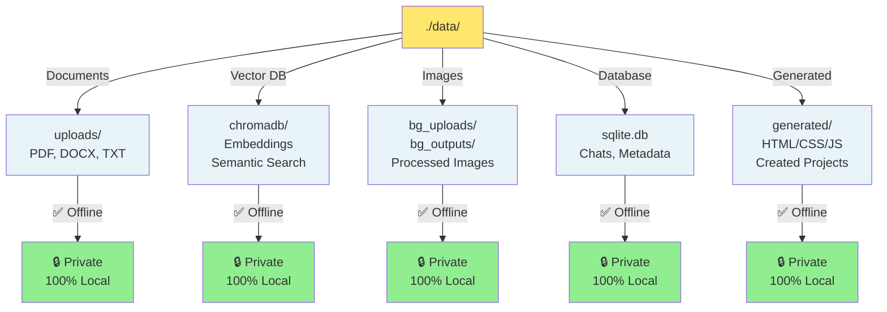

---

## Performance Timeline - Single Requests

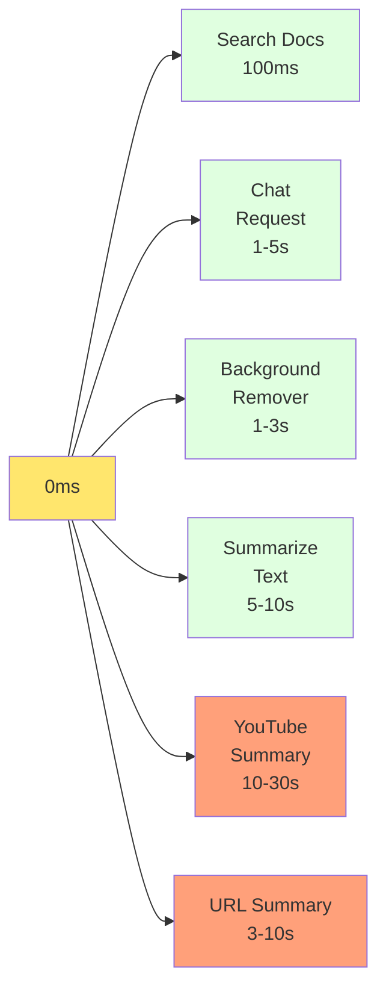

---

## Mode Switching Logic

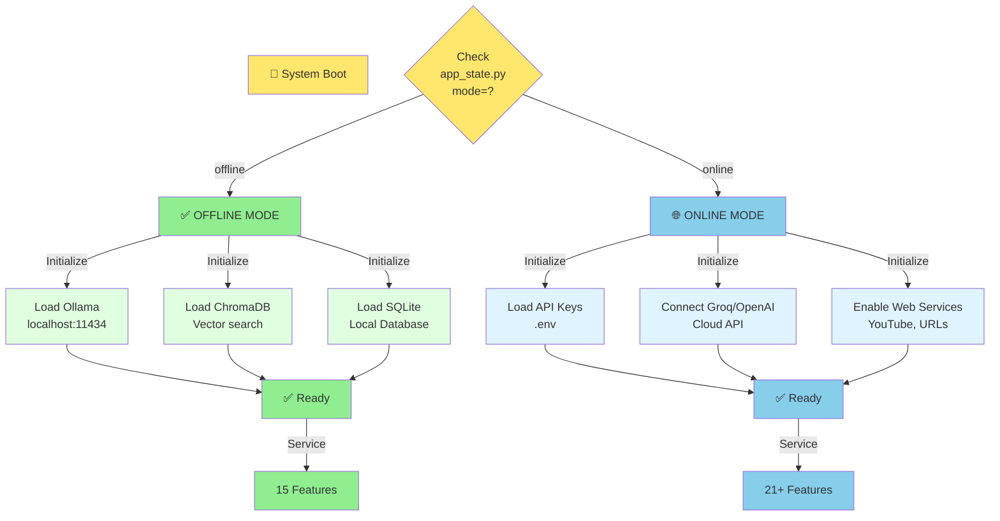

---

## Browser Extension - Integration

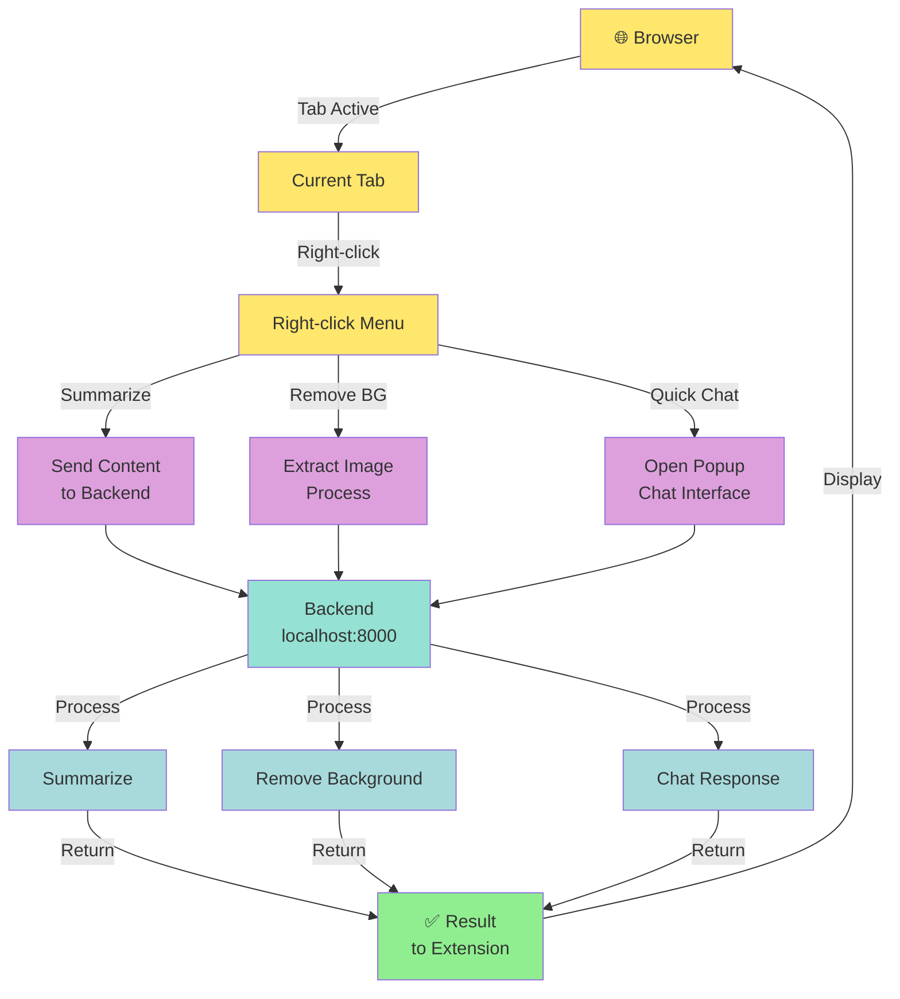

---

## Error Handling & Recovery

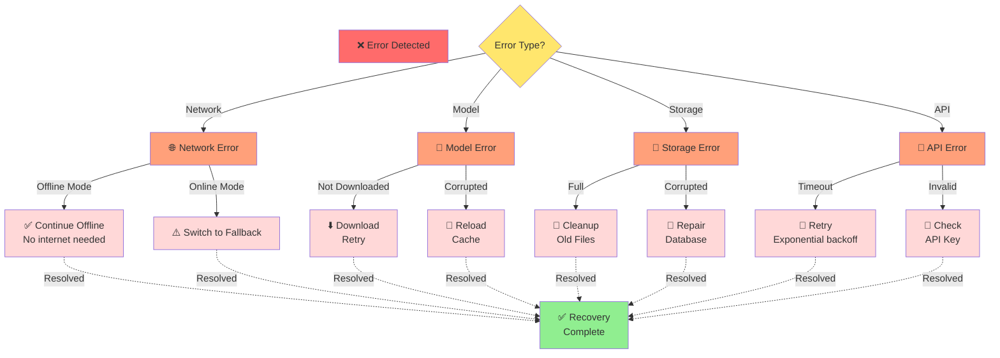

---

**These flowcharts provide visual representations of:**
- System architecture
- Data flows
- Feature organization
- Privacy levels
- Installation process
- Multi-agent logic
- Mode switching
- Integration points

**To view these diagrams:**
1. Open this file in VS Code with Markdown Preview
2. Install "Markdown Preview Mermaid Support" extension
3. View diagrams in real-time

